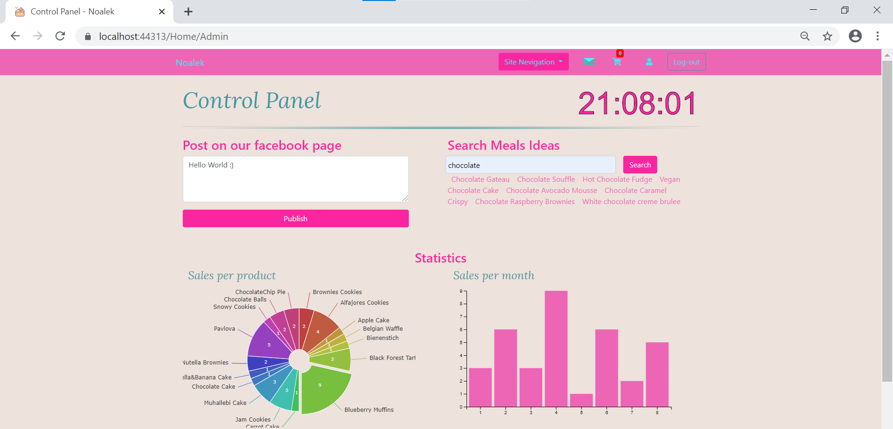

# Noalek Patisserie - Web Application 🍰


### Contents

- [Description](#description)
- [How To Use](#How-To-Use)
- [Images](#Images)
- [Authors](#authors)
---
## Description

<p>Web Application for my future Patisserie we developed during our "Web Application Development" course taught by Dr. Igor Rochlin.</p>
<p>In this project we combined my 2 specialities - programming & baking 💻🍰</p>
Through this project we gained a higher level of understanding in programming web applications using MVC architecture.

#### Languages

- C#
- JavaScript (jQuery and d3js libraries)
- Html / css
- LINQ
- Razor

##### [Back To The Top](#Contents)
---
## How To Use

#### Installation
- Export git repositorie to visual studio
- In visual studio build the project and open NuGet package manager console
- Run the following command ```Update-Database```<br/>
(if you get an error in this step please delete the entire migration folder and run ```Enable-Migrations``` following by ```Add-Migration init``` and ```Update-Database```)
- Update the database tabels with the queries listed in ```DB-Queries``` file 
- Build and run the application

##### [Back To The Top](#Contents)
---
## Images

<p align="center">  </p>

##### [Back To The Top](#Contents)
---
## Authors

* **Saar Davidson** - [LinkedIn](https://www.linkedin.com/in/saar-davidson/)
* **Iris Kella** - [LinkedIn](https://www.linkedin.com/in/iris-kella-341549111/)
* **Nikol Arazi** - [LinkedIn](https://www.linkedin.com/in/nikol-arazi-55053a199/)
* **Noa Cohen** - [LinkedIn](https://www.linkedin.com/in/noalecohen1/)

##### [Back To The Top](#Contents)
